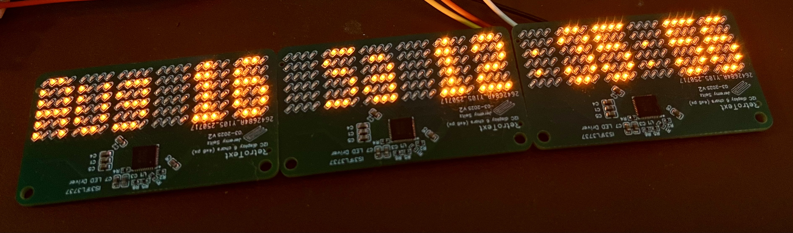
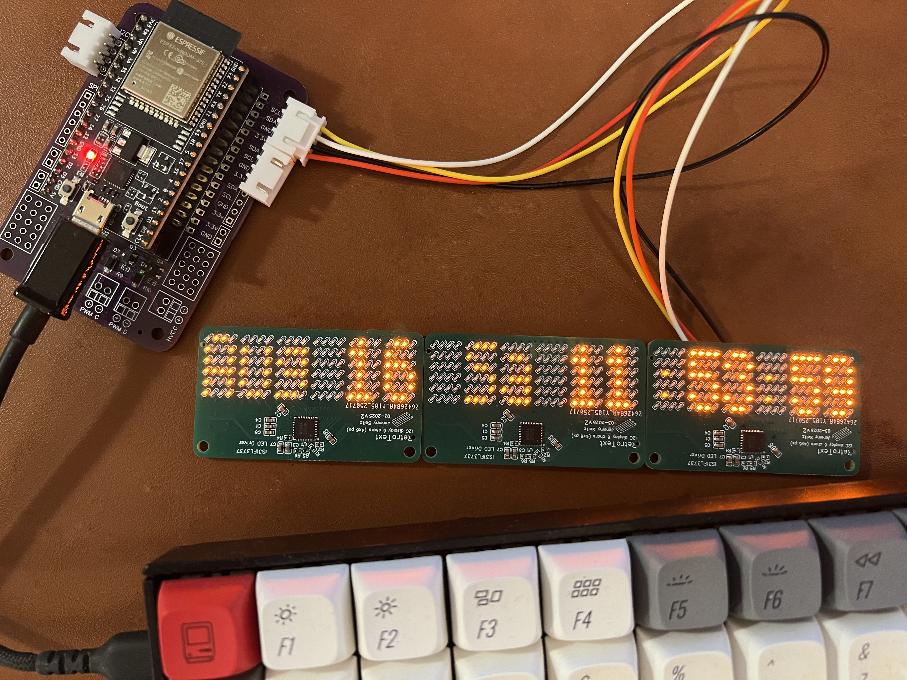
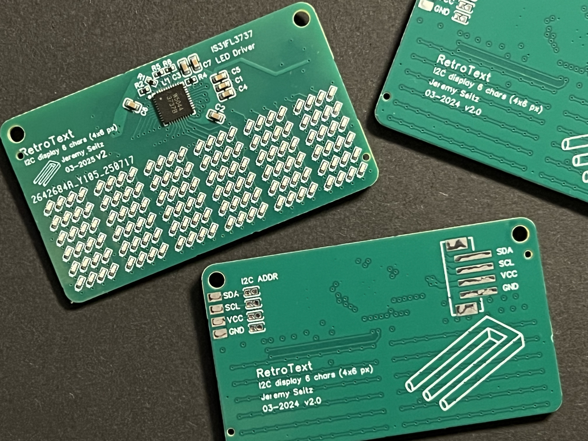

# RetroText

Version 1.1, Aug 2025

## Beautiful Blocky Retro Display

An old pinball machine, an industrial control panel, a scifi computer - these are all where you would expect to see warm glowing chunky pixel displays that overcome the low-resolution limitions with somehow recognizable characters.

The RetroText PCB offers six 4x6 character cells, spaced just so. Driven by a IS31FL3737 LED driver, it offers fast updates and 265-levels of brightness per-pixel. A simple 3v3 I2C 4-pin interface makes talking to microcontrollers easy.

Each PCB module wires up 144 retro orange 0402 SMD LEDs, arranged into 4x6 sections. The I2C address can be selected using a soldering jumper on the back of the PCB. There are 4 possible addresses: 0x50, 0x5A, 0x5F, 0x54.

## RetroText Firmware

The firmware is developed in CPP using PlatformIO. The example works with the ESP32-Dev board, but can be adapted to other microcontrollers that support I2C. 

There are 4 modes of operation:

- Modern Font - smooth scrolling, modern font
- Retro Font - pixel-perfect scrolling, retro font
- Clock - display the current time and date
- Animation - display a meteor animation with parallax stars

The main loop is in `src/main.cpp`. The display is managed by the `DisplayManager` class in `src/DisplayManager.cpp`. The fonts are defined in `include/fonts/`. The messages are defined in `include/messages.h`.
